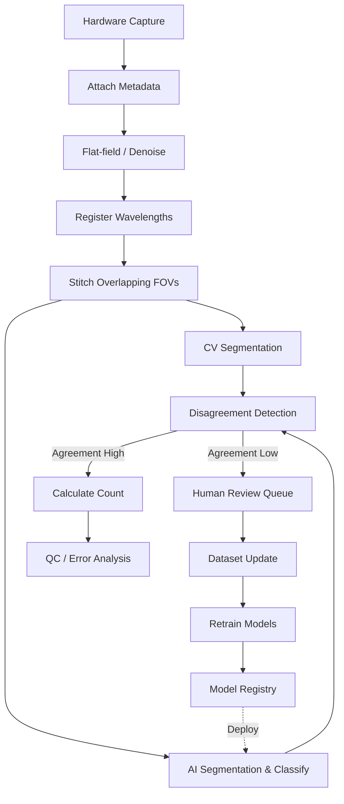

# Final AI/CV Pipeline

This document defines the integrated production pipeline, moving from hardware capture through to the final count and dataset loop.

## Pipeline Architecture

## Stage Definitions

1. **Acquisition**: The Raspberry Pi captures raw sensor data.
2. **Metadata**: The system logs timestamp, exposure, focus score, wavelength, and stage coordinates into a `manifest.json`.
3. **Multispectral Capture**: Multiple frames are captured at different wavelengths without moving the stage.
4. **Registration**: Micro-shifts between multispectral frames are corrected.
5. **Stitching**: Overlapping fields of view (FOVs) are stitched into a single large mosaic image to prevent double-counting cells on the borders.
6. **Preprocessing**: Dark-frame and flat-field corrections are applied.
7. **CV Segmentation**: Classical thresholding and watershed run to provide a robust baseline detection.
8. **Neural Segmentation & Classification**: The fine-tuned AI model (e.g., YOLO11-seg or UNet) segments and classifies the objects.
9. **Disagreement Detection**: The system compares the CV bounding boxes against the AI bounding boxes. Large discrepancies trigger a review flag.
10. **Counting**: 
    - *Prototype*: The system simply counts the total number of visible objects per stitched field.
    - *Production*: The system converts the raw count to a clinical concentration metric (e.g., cells/μL) using the known imaged volume of the engineered cartridge. We do *not* directly predict the final CBC count with an end-to-end model; the primary count is strictly derived from segmented objects.
11. **Quality Control**: The count is checked against physiological limits to flag catastrophic failures.
12. **Pseudo-label Update**: High-confidence predictions where CV and AI agree are automatically added to the dataset as pseudo-labels.
13. **Active Learning (Label Queue)**: Low-confidence AI predictions or high CV/AI disagreement cases are pushed to a dashboard for human review and correction.
14. **Retraining**: The model is periodically retrained on the growing dataset.
15. **Model Registry**: The newly trained model is versioned and staged for over-the-air deployment back to the hardware.
16. **Future Cartridge Calibration**: The pipeline will integrate with physical calibration targets inserted into the machine to ensure the volume calculations remain accurate.
