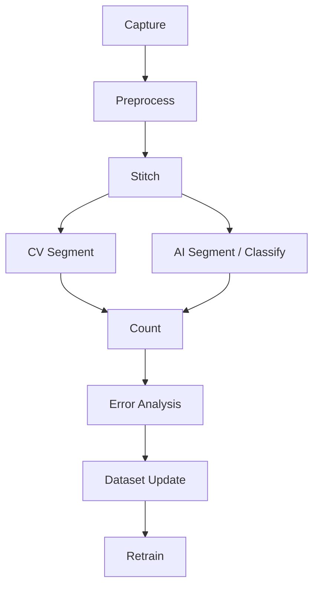

# Final AI/CV Pipeline

This document outlines the final integrated pipeline, merging hardware acquisition, classical CV, and AI models.

## Pipeline Architecture

## Stages

- **Acquisition**: Raspberry Pi captures raw sensor data.
- **Metadata**: System logs timestamp, exposure, focus, and wavelength.
- **Multispectral capture**: Multiple frames captured at different wavelengths.
- **Image alignment**: Correcting micro-shifts between multispectral frames.
- **Stitching**: Combining overlapping FOVs into a single large mosaic.
- **CV segmentation**: Classical thresholding and watershed for robust baseline detection.
- **AI segmentation/classification**: Neural networks refine segmentations and classify object types.
- **Pseudo-label loop**: CV outputs and high-confidence AI outputs generate labels for future training.
- **Active learning**: Low-confidence predictions and high CV/AI disagreement cases are flagged for human review.
- **Count comparison**: Comparing CV counts vs. AI counts for quality control.
- **Error tracking**: Logging failures to improve future models.
- **Model retraining**: Updating the AI models as the dataset grows.
- **Future cartridge calibration**: Integrating calibration targets to ensure consistent results.

## Count Strategy

- **For prototype**: The system will simply count the total number of visible objects per image or stitched field.
- **For production cartridge**: The system will convert the raw count to a clinical concentration metric (e.g., cells per microliter) using the known imaged volume and any dilution/calibration factors.
