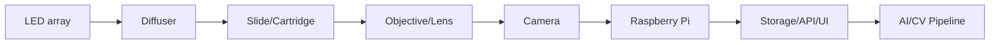

# Hardware Architecture

The CBC scanner hardware is designed to evolve from an accessible 3D-printed prototype to a robust production system.

## Subsystems

- **Optics**: Microscope objective/lens setup to achieve the necessary magnification.
- **Camera**: Raspberry Pi with an InnovaMaker IMX296 global shutter camera.
- **Illumination**: Multispectral LED array with a diffuser for uniform lighting.
- **Slide/Cartridge Holder**: Secures standard microscope slides (prototype) or known-volume cartridges (production).
- **XY Movement**: Enables scanning across the sample.
- **Z Focus**: Adjusts focus depth.
- **Frame**: The main structural support (3D printed initially, rigid later).
- **Electronics Mounting**: Secures the Raspberry Pi, motor drivers, and power distribution.
- **Cable Management**: Routing for camera ribbon cables, motor wiring, and power.

## System Diagram

## Prototype vs. Production Differences

The **Prototype** uses mostly 3D printed components for the main frame, mounts, and holders to allow rapid iteration. It utilizes standard microscope slides and focuses on capturing overlapping images for stitching.

The **Production** system will transition to a rigid frame, repeatable optical path, and a controlled, known-volume cartridge. It will move away from fully 3D printed precision motion components, utilizing them only for low-load non-critical parts.
