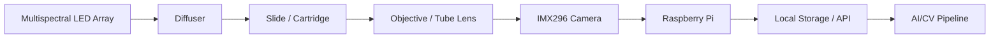
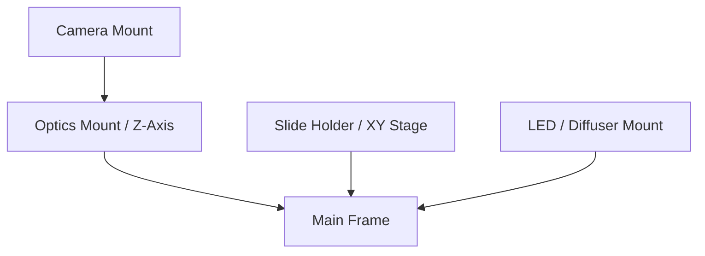

# Hardware Architecture

The CBC scanner hardware is designed to evolve from an accessible, easily iteratable 3D-printed prototype to a robust, precisely calibrated production system.

## System Purpose
The primary purpose of the hardware is to acquire high-resolution, multispectral images of biological samples (specifically blood cells) with sufficient clarity and consistency to enable automated computer vision and AI-based counting/classification.

## Prototype vs. Production Philosophy
- **Prototype**: Focuses on accessibility, rapid iteration, and software integration. It uses off-the-shelf components, standard microscope slides, and 3D-printed brackets where possible. The primary goal is capturing 5-10 overlapping images to prove the stitching and baseline segmentation pipeline.
- **Production**: Focuses on stability, repeatability, and quantitative accuracy. It will transition to a rigid chassis (sheet metal/machined aluminum), precision linear guides, and a custom *known-volume* cartridge necessary for calculating absolute cell concentrations.

## Subsystem Descriptions

- **Optics**: A compound microscope optical path utilizing standard objectives (e.g., 10X or 40X Plan Achromatic) to achieve the necessary magnification and flat field of view.
- **Camera**: Raspberry Pi acting as the host for an InnovaMaker IMX296 global shutter camera. Global shutter is critical to prevent motion blur during continuous scanning or under pulsed illumination.
- **Illumination**: A multispectral LED array (e.g., 405nm, 470nm, 530nm, 660nm) coupled with a diffuser to provide uniform transmitted or reflected light.
- **Slide/Cartridge Holder**: A mechanical stage to securely hold the sample. The prototype uses standard glass slides; production will use a custom cartridge.
- **XY Stage**: Enables scanning across the sample. The prototype uses metal rods/rails; production will use high-precision linear guides.
- **Z Focus**: Adjusts focus depth, utilizing a lead screw or fine-pitch threaded rod driven by a stepper motor.
- **Frame/Enclosure**: The structural backbone. Must block ambient light to ensure controlled multispectral capture.
- **Raspberry Pi/Electronics Mount**: Secures the compute module, motor drivers, and power distribution securely away from the optical path to manage heat.
- **Cable Routing**: Cable chains or clips to route the MIPI camera ribbon cable and motor wires, preventing snagging during stage movement.
- **Power**: A centralized power supply (e.g., 12V or 24V for motors, stepped down to 5V for the Raspberry Pi).
- **Calibration Tools**: Stage micrometers and calibration slides for mapping pixel dimensions to physical microns.

## System Block Diagram

## Mechanical Stack Diagram

## Assumptions
- The prototype uses normal microscope slides initially.
- The final cartridge will be engineered later.
- The prototype only needs to capture 5 to 10 overlapping images and stitch them.
- The final system will use a known volume for concentration calculations.

## Engineering Risks
- **Blur**: From external vibrations or internal motor resonances. Mitigation: Dampening feet, global shutter.
- **Poor Focus**: Drift in the Z-axis. Mitigation: Anti-backlash nuts, rigid Z-carriage.
- **Vibration**: Camera shutter or fan causing micro-vibrations.
- **Backlash**: Slop in the XY stage leading to inaccurate overlapping. Mitigation: Hardware anti-backlash nuts, software backlash compensation.
- **Uneven Illumination**: Hotspots in the light source. Mitigation: High-quality diffusers, flat-field correction in software.
- **Insufficient Magnification**: Resolution too low to differentiate cell types. Mitigation: Validate 40X objective performance.
- **Bad Image Stitching**: Failure to align overlapping regions. Mitigation: Require 40-60% overlap and rich features.
- **Object Detection False Positives**: Dust on the sensor or lens being counted as cells. Mitigation: Enclosure, software filtering based on static object detection.
