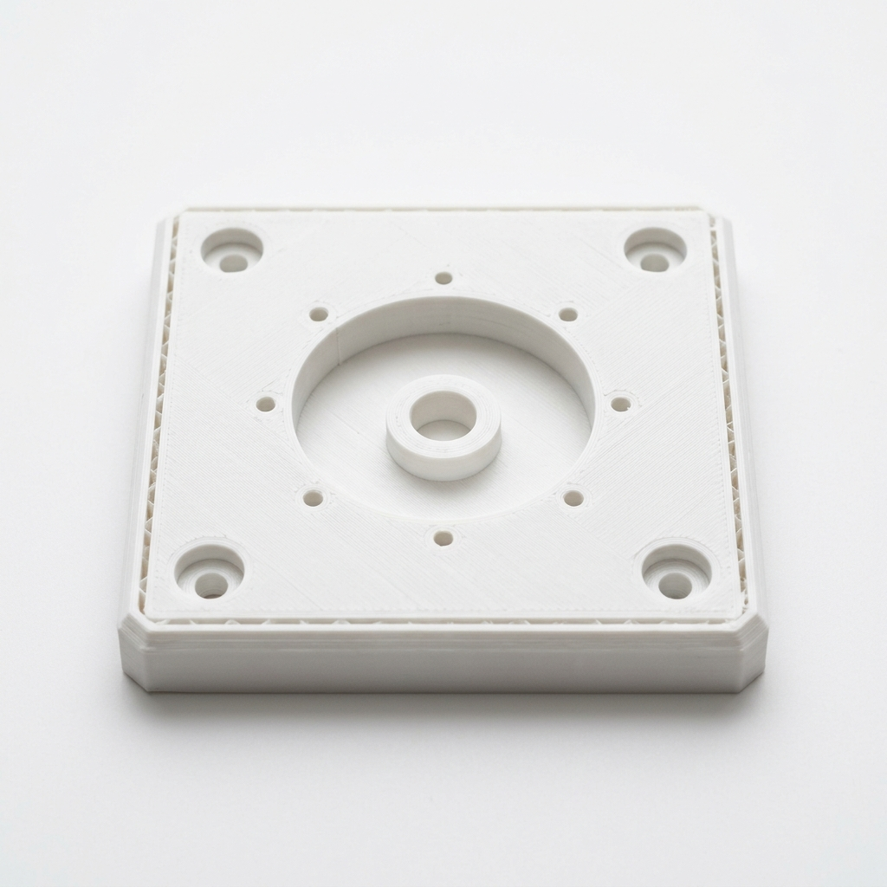
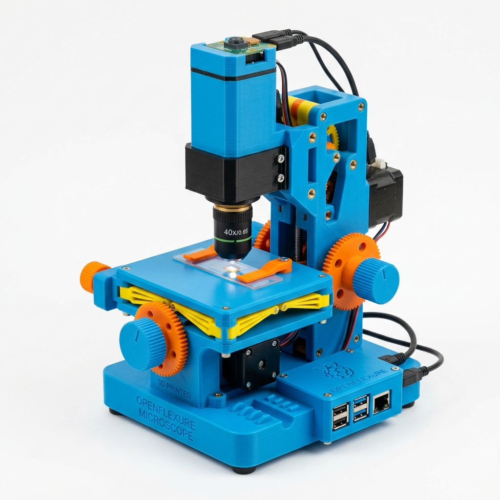
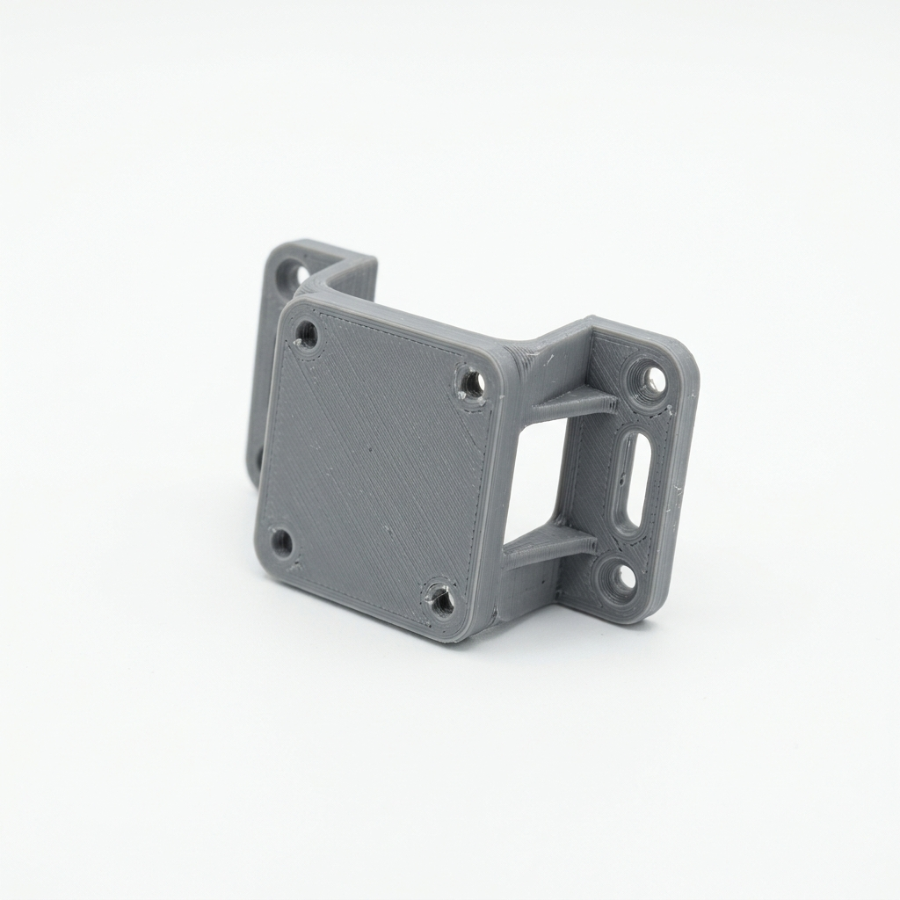
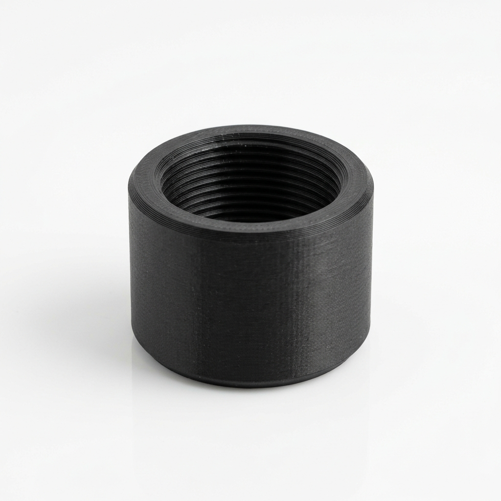
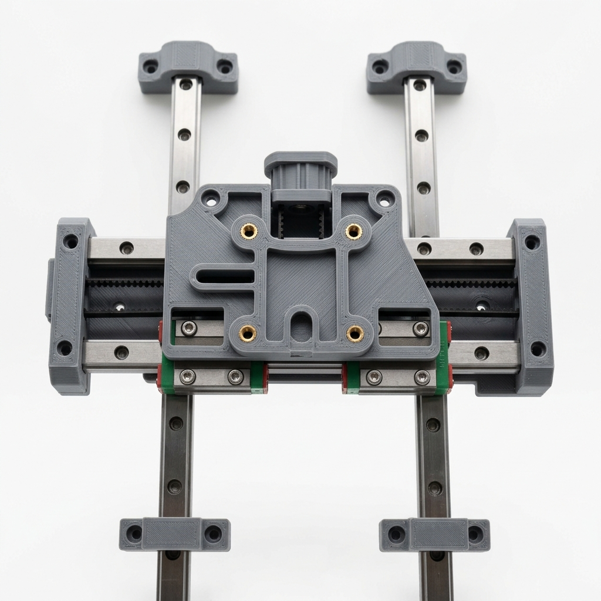
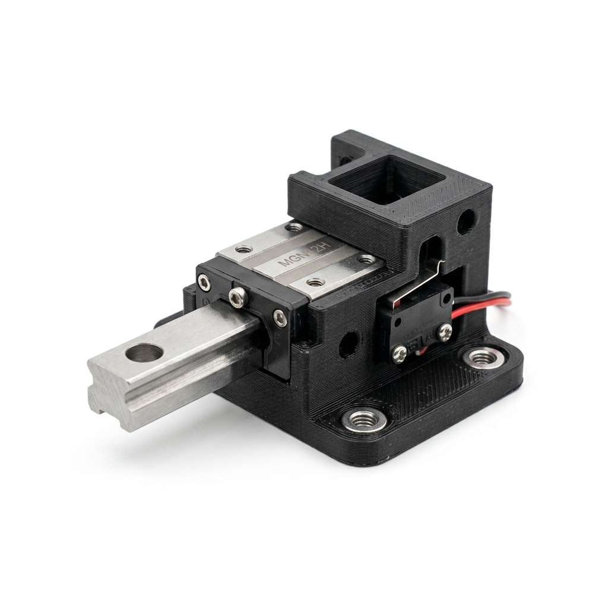
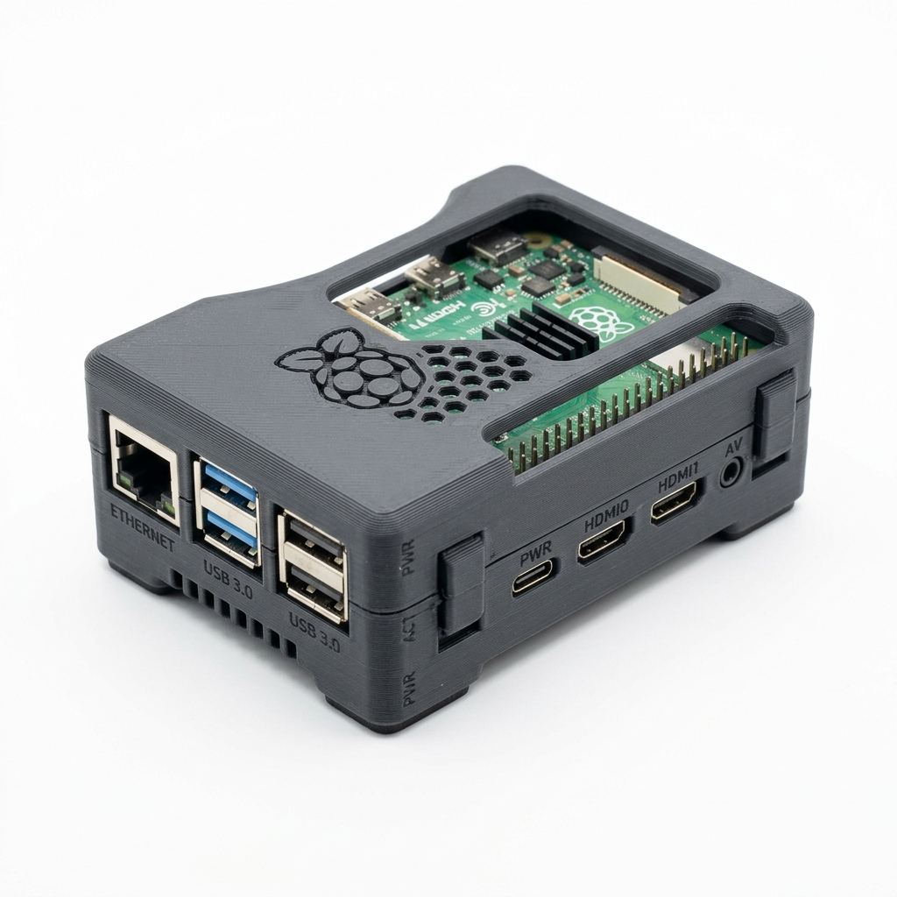
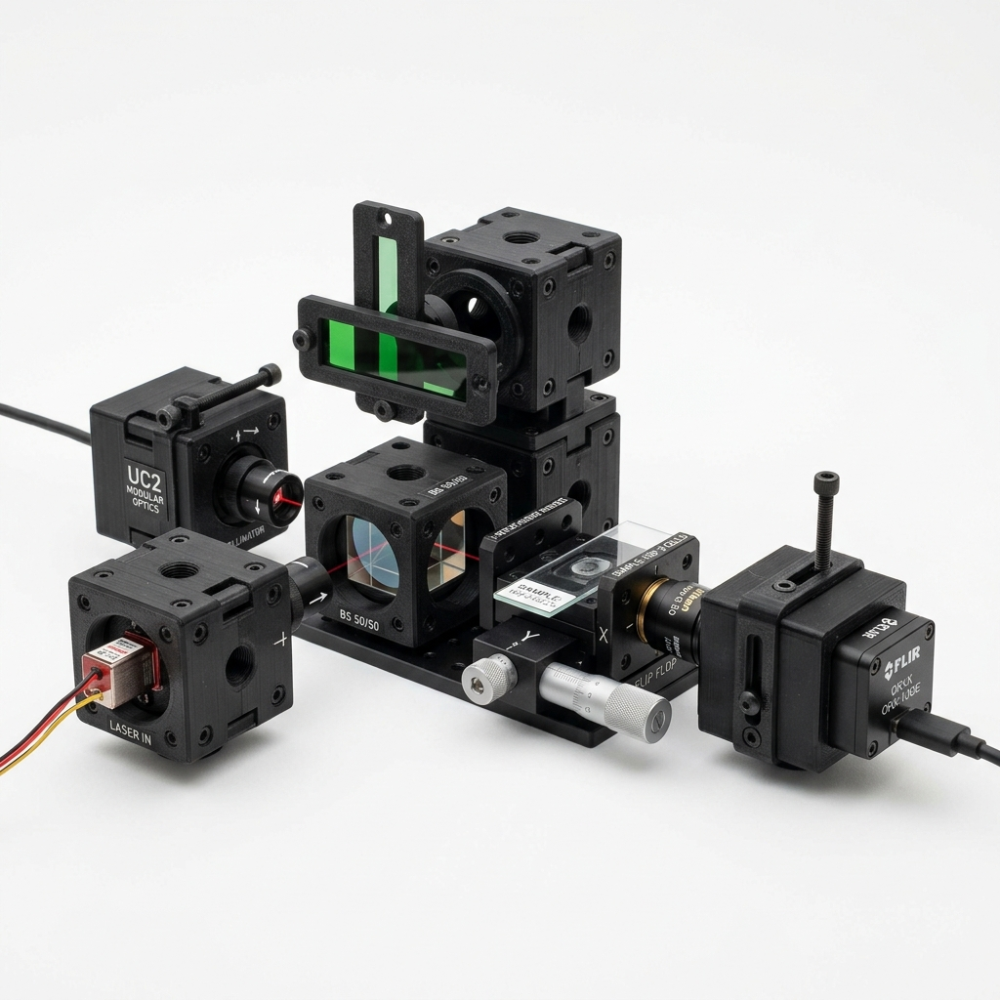

# 3D Printing Plan

## 1. Purpose
This document outlines the engineering plan for fabricating the prototype chassis using Fused Deposition Modeling (FDM) 3D printing. The goal is to produce rigid, accurate parts that maintain optical alignment while allowing rapid iteration.

## 2. Printing Strategy
- **Rigidity over speed**: Print with higher wall counts rather than high infill.
- **Optical considerations**: Use matte black materials for any parts near the optical path to reduce stray light reflections.
- **Modularity**: Design parts to bolt together rather than printing massive single unibodies. This reduces print failure risk and allows replacing single brackets.

## 3. Printer/Material Assumptions
- Standard FDM printer (e.g., Prusa i3, Bambu Lab, Ender 3).
- 0.4mm nozzle.
- Textured or smooth PEI build plate.

## 4. Material Selection
- **PLA**: Acceptable for the first, quick prototype. It is stiff and easy to print.
- **PETG**: Recommended for parts near the LEDs or motors, as PLA will deform under heat.
- **ABS/ASA**: Best for long-term prototypes due to high heat deflection, but harder to print without an enclosure.
- **Matte Black PLA/PETG**: Strongly preferred for the optical tower and lens mounts. Flocking material or matte black paint can be applied post-print if standard shiny filament is used.

## 5. Print Settings
- **Layer Height**: 0.2mm (standard). Use 0.12mm for fine threaded parts if not using metal inserts.
- **Wall Count (Perimeters)**: Minimum 4 walls. This is where the part gets its strength.
- **Infill**: 20% - 40% Gyroid or Cubic.
- **Supports**: Avoid where possible. Orient parts so critical mounting holes print cleanly.

## 6. Printable Parts Breakdown

| Part | Preview | STL/CAD Link | Material & Print Settings | Orientation | Notes |
| :--- | :--- | :--- | :--- | :--- | :--- |
| Baseplate |  | Custom CAD required | PETG, 25% infill, 4 walls | Flat | **Main foundation**. Heavy and rigid. Hardware: M3 inserts |
| Optical Tower |  | [OpenFlexure v7 Base](https://openflexure.org/projects/microscope/build) | Black PETG, 40% infill, 5 walls | Vertical | **Z-axis support**. Use as reference design. Hardware: M3 screws |
| Camera Mount |  | [Raspberry Pi HQ Mount](https://www.thingiverse.com/thing:4357597) | PETG, 30% infill, 4 walls | Flat | **Holds IMX296**. Modify for IMX296 hole spacing. Hardware: M2.5 screws |
| Objective Holder |  | [RMS to C-mount adapter](https://www.thingiverse.com/thing:2988173) | Black PETG, 50% infill, 5 walls | Flat | **Holds RMS lens**. Thread tolerances are critical. May need 0.12mm layers. Hardware: None |
| XY Carriage |  | Custom CAD required | PLA/PETG, 30% infill, 4 walls | Flat | **Moves sample**. Must mount to linear rails. Hardware: MGN12 blocks |
| Rail Holders |  | Custom CAD required | PETG, 40% infill, 4 walls | Flat | **Secures MGN12**. . Hardware: M3 screws |
| Lead Nut Mount |  | Custom CAD required | PETG, 30% infill, 4 walls | Flat | **Drives XY**. . Hardware: Anti-backlash nut |
| Pi Case/Mount |  | [RPi 4 Snap-fit Case](https://www.printables.com/model/4074-raspberry-pi-4-snap-fit-case) | PLA, 20% infill, 3 walls | Flat | **Holds RPi**. . Hardware: None |

## 7. Parts Not Suitable for Printing
- Precision linear rails (MGN12).
- Lead screws and nuts.
- Bearings.
- Optical lenses.
**Rule:** Avoid plastic-on-plastic sliding for anything requiring repeatable movement (like the XY stage). It causes stiction and backlash.

## 8. Downloadable STL/CAD Options
We leverage open-source designs where possible:
- **OpenFlexure Microscope**: Excellent reference for 3D printed flexure mechanisms if we decide to avoid linear rails for the Z-axis. [View Project](https://openflexure.org/)
   
- **UC2 Modular Microscopy**: Great reference for magnetic, modular optical cubes. [View GitHub](https://github.com/openUC2/UC2-GIT)
   

## 9. Tolerance and Fit Guidance
- Add **0.2 mm to 0.4 mm** clearance to CAD dimensions for printed fits (e.g., a peg going into a hole).
- Holes intended for M3 screws to pass through freely should be modeled at **3.2mm - 3.4mm**.
- Holes for heat-set inserts should be sized according to the insert manufacturer's spec (typically ~4.0mm diameter for an M3 insert).
- Use chamfers (not fillets) for overhangs near the build plate to prevent elephant's foot from ruining tolerances.

## 10. Heat-Set Insert Guidance
Use M3 heat-set inserts (like those from CNC Kitchen) for parts that will be repeatedly assembled/disassembled. Press them in using a soldering iron set to the melting temperature of the filament (e.g., 200°C for PLA).

## 11. Part Versioning
Append a version number to all exported STLs: `XY_Carriage_v1.2.stl`. Store them in `design-docs/assets/stl/`.

## 12. Quality Checklist
- [ ] No stringing or blobs inside the optical path.
- [ ] Dimensions measure within 0.1mm of CAD using calipers.
- [ ] M3 screws pass through clearance holes freely.
- [ ] Heat set inserts sit flush with the surface.
