# Prototype Product List

This document details the exact components required for the prototype build, including researched pricing and links.
*Prices verified as of May 10, 2026. Do not invent unavailable prices.*

| Subsystem | Part (Qty) | Purpose | Selected Product | Price | Vendor Link | Image | Notes |
| :--- | :--- | :--- | :--- | :--- | :--- | :--- | :--- |
| Compute | Raspberry Pi 4 (1) | Control & Capture | Raspberry Pi 4 (4GB) | $55.00 | [Adafruit/PiShop](https://www.raspberrypi.com/products/raspberry-pi-4-model-b/) |  | **High**: Need adequate cooling. |
| Compute | MicroSD Card (1) | OS Storage | Generic 32GB Class 10 | $8.00 | [Amazon](https://www.amazon.com/SanDisk-128GB-microSDXC-Memory-Adapter/dp/B073JYC4XM/) |  | **High**: High endurance preferred. |
| Compute | Power Supply (1) | Power RPi | Generic 5V 3A | $8.00 | [Amazon](https://www.amazon.com/Raspberry-Pi-Official-Supply-Type-C/dp/B07W8XHMJZ/) |  | **High** |
| Camera | IMX296 Camera (1) | Image Sensor | InnovaMaker IMX296 | $60.00 | [InnovaMaker](https://www.inno-maker.com/product/imx296-camera-module/) |  | **Critical**: Global shutter required. |
| Camera | MIPI Cable (1) | Data connection | Included with camera | $0.00 | - |  | **High**: Pi 5 uses different pitch. |
| Optics | 40X Objective (1) | Magnification | AmScope Standard 40X | $45.00 | [AmScope](https://amscope.com/products/40x-plan-achromatic-objective-lens-with-knurled-ring) |  | **Critical**: "Plan" is needed for flat fields. |
| Optics | Calibration Slide (1) | Scale reference | Printed Grid (Not rec) | $20.00 | [AmScope](https://amscope.com/products/microscope-stage-calibration-slide-for-usb-camera-0-01mm-stage-micrometer) |  | **Medium**: Essential for measuring FOV. |
| Sample | Glass Slides (1) | Hold sample | Standard box of 72 | $10.00 | [Amazon](https://www.amazon.com/AmScope-BS-72P-100S-22-Pre-Cleaned-Microscope-Coverslips/dp/B0018N8N5K/) |  | **High** |
| Illumination/Control | LED Driver Board (1) | PWM LED Control | Adafruit TLC5947 | $17.50 | [Adafruit](https://www.adafruit.com/product/1429) | 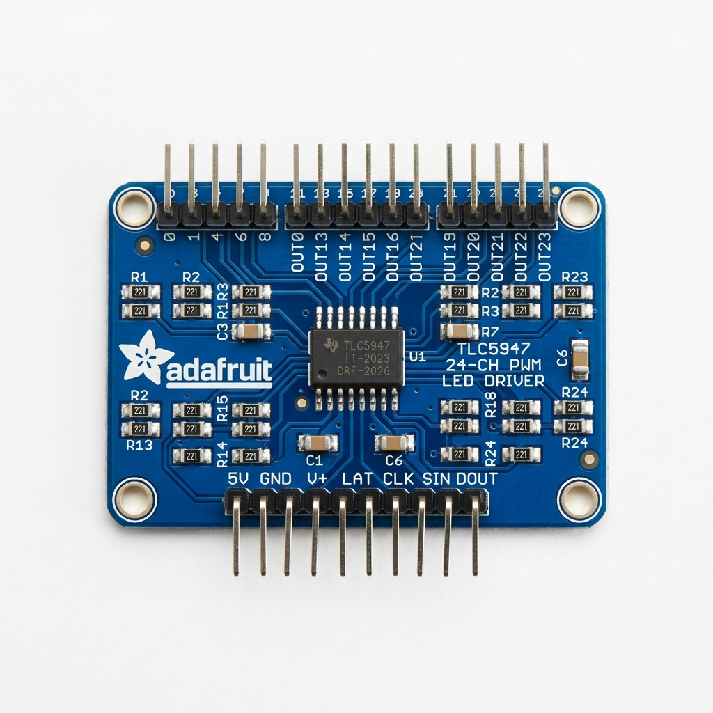 | **Critical**: Version 1 multispectral LED driver. 24 constant-current sink channels with 12-bit PWM. Suitable for low-power LEDs, not 1W/3W high-power LEDs. |
| Illumination/Timing | Microcontroller (1) | LED timing controller | Raspberry Pi Pico RP2040 | $4.00 | [Adafruit](https://www.adafruit.com/product/4864) | 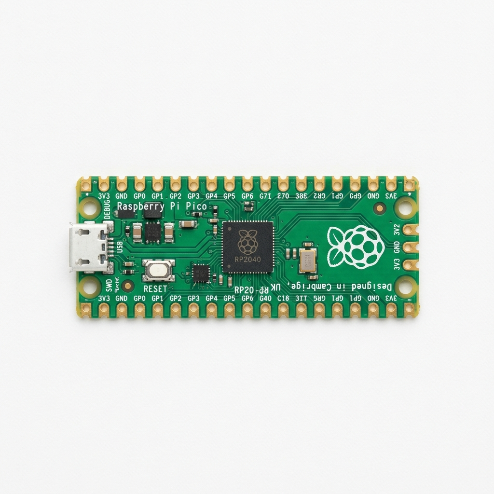 | **High**: High-level orchestration on RPi, lower-jitter LED timing on Pico. Communicates via USB serial. |
| Illumination/Carrier | LED Solder Board (1) | Mounting wavelength LEDs | Adafruit Perma-Proto Quarter | $5.95 | [Adafruit](https://www.adafruit.com/product/589) | 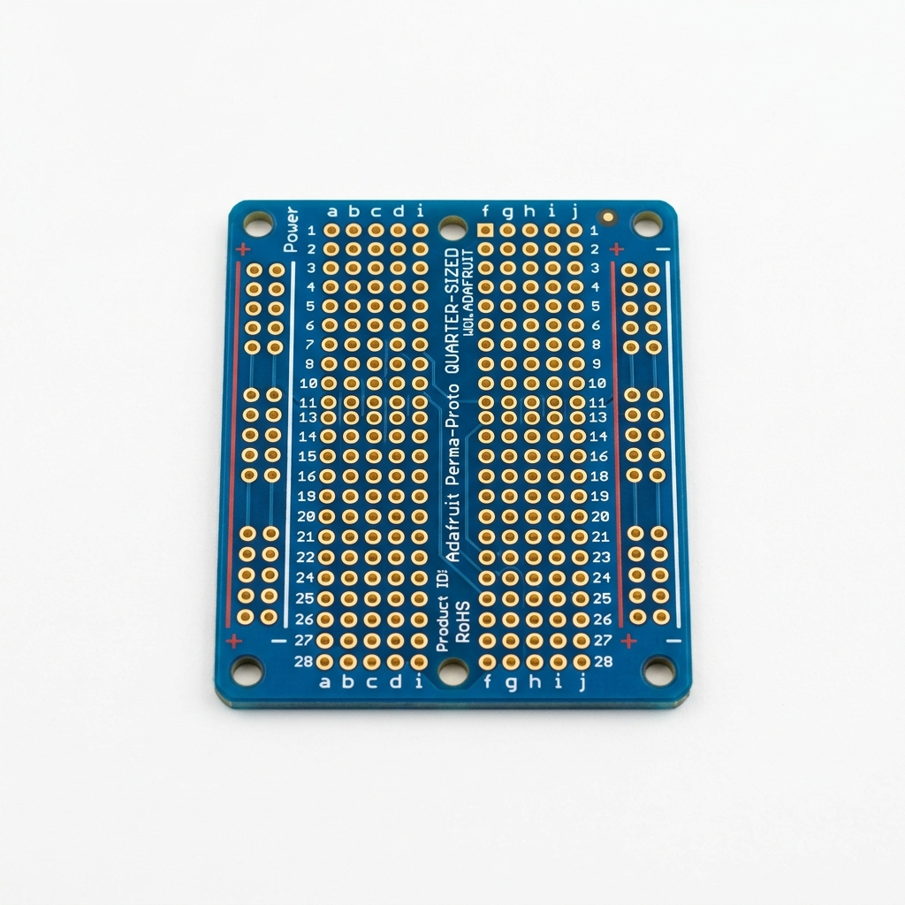 | **High**: Version 1 LED carrier board. Solder LEDs here, wire to TLC5947. Replace with custom circular PCB later. |
| Illumination/Optics | Diffuser Sheet (1) | Smooths LED illumination | LEE Filters 216 White Diffusion | $10.00 | [Amazon](https://www.amazon.com/Photography-Diffusion-Lighting-Filter-Continuous/dp/B07R451FZT) | 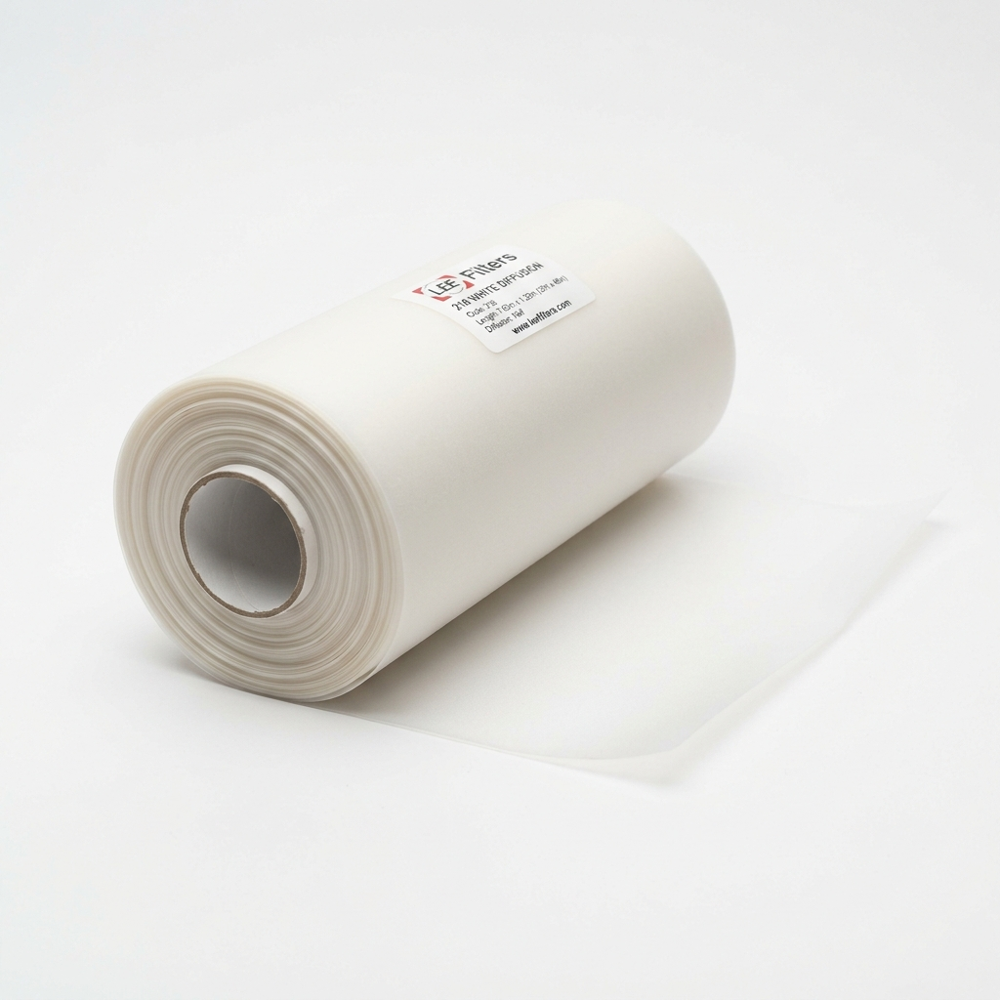 | **Critical**: Cut squares/circles and mount between LED carrier and sample to reduce hotspots. |
| Illumination/Wiring | Jumper Wire Kit (1) | Wiring Pico, TLC5947, Carrier | Premium Female/Female Jumper Wires | $3.95 | [Adafruit](https://www.adafruit.com/product/266) | 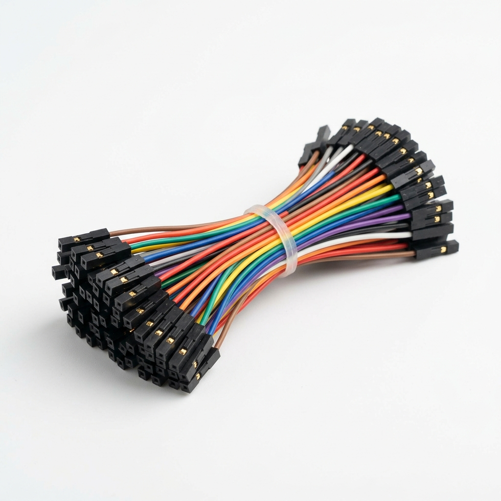 | **Medium**: Use short wires to reduce clutter. |
| Illumination/Wiring | JST Connector Kit (1) | Removable carrier wiring | JST PH 2-pin Cable Set | $4.95 | [Adafruit](https://www.adafruit.com/product/3814) | 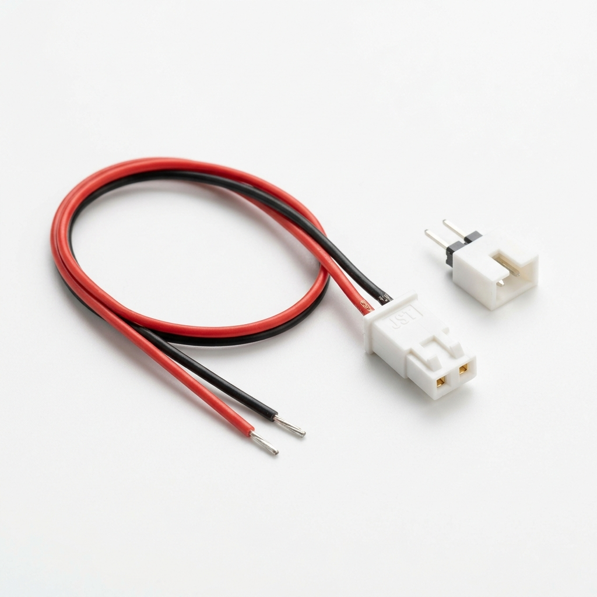 | **Medium**: Makes LED carrier board replaceable. |
| Motion | Linear Rails (2) | XY smooth travel | Generic MGN12 (KB3D) | $20.00 | [KB3D](https://kb-3d.com/store/linear-rails-carriages/1000-hiwin-mgn12h-linear-rail-carriage-1647468641973.html) |  | **High**: Avoid printed sliding parts. |
| Motion | Lead Screw (2) | XY actuation | Standard threaded rod | $15.00 | [Amazon](https://www.amazon.com/ReliaBot-400mm-Thread-Anti-Backlash-Printer/dp/B08CZGKS7D/) |  | **High** |
| Motion | Stepper Motor (2) | Automated XY | 28BYJ-48 (Not rec) | $14.00 | [Pololu](https://www.pololu.com/product/2267) |  | **Low**: Start with manual knobs. |
| Motion | Motor Driver (2) | Control Stepper | A4988 | $8.00 | [Pololu](https://www.pololu.com/product/3281) |  | **Low**: TMC provides silent operation. |
| Fasteners | Screw Kit (1) | Assembly | Generic Kit | $15.00 | [Amazon](https://www.amazon.com/VIGRUE-Screws-Washers-Assortment-Wrenches/dp/B07FCQ4Q5Z/) |  | **High** |
| Fasteners | Threaded Inserts (1) | Assembly | Generic M3 inserts | $12.00 | [Amazon](https://www.amazon.com/M3x5x4-Threaded-Insert-Embedment-Printing/dp/B0784VQ1T2/) |  | **High**: Required for durable threads. |

## Version 1 Multispectral LED Diode Set

| Channel | Wavelength | Qty | Candidate Product | Verified Price | Vendor Link | Image | Notes |
| :--- | :--- | :--- | :--- | :--- | :--- | :--- | :--- |
| Violet / Soret | 405 nm | 3-5 | Bivar UV5TZ-405-30 5mm | $1.00 ea | [Mouser](https://www.mouser.com/ProductDetail/Bivar/UV5TZ-405-30) | 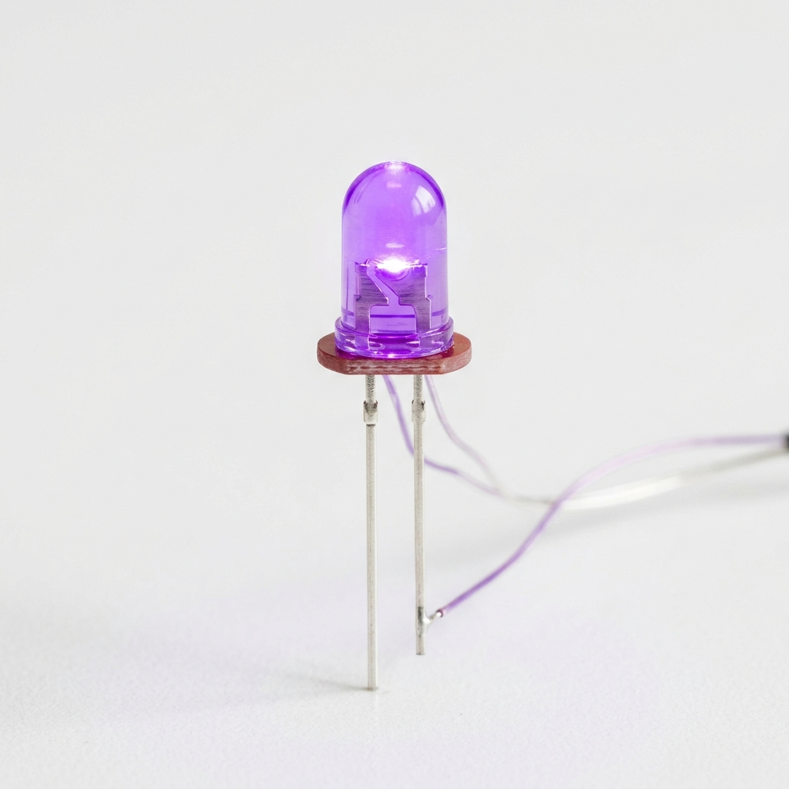 | Hemoglobin/Soret-region contrast. Use eye safety precautions. |
| Blue | 470 nm | 3-5 | Kingbright WP7113QBC/D 5mm | $0.50 ea | [Mouser](https://www.mouser.com/ProductDetail/Kingbright/WP7113QBC-D) | 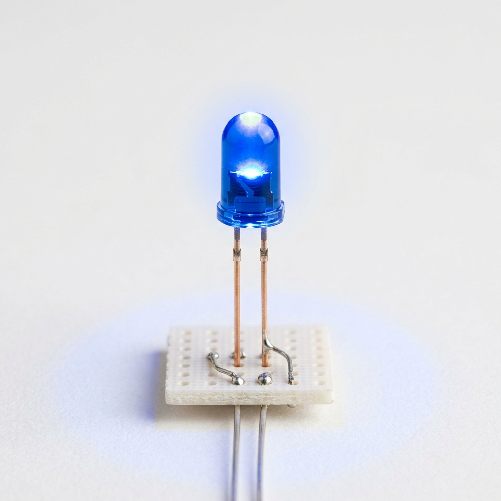 | Blue channel for stain and WBC contrast. |
| Cyan | 505 nm | 3-5 | Kingbright WP7113CGCK 5mm | $0.50 ea | [Mouser](https://www.mouser.com/ProductDetail/Kingbright/WP7113CGCK) | 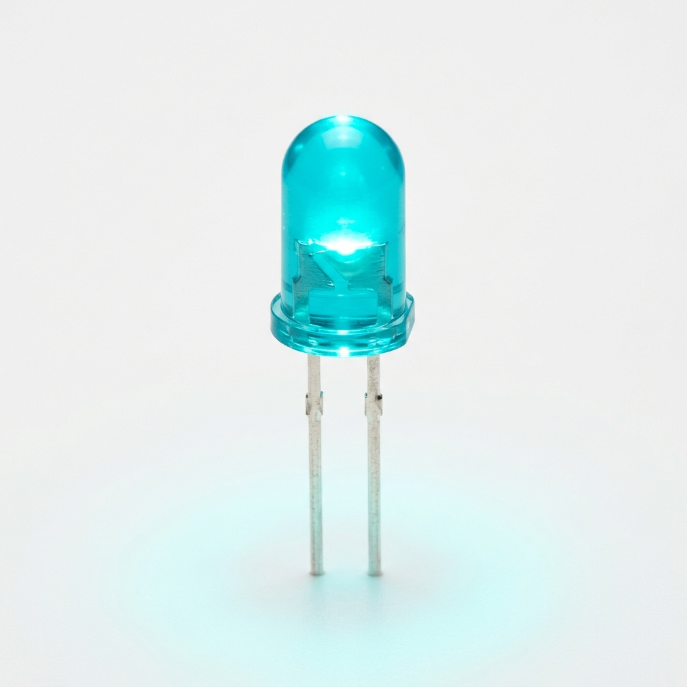 | Optional extra channel between blue and green. |
| Green | 530 nm | 3-5 | Kingbright WP7113ZGC 5mm | $0.50 ea | [Mouser](https://www.mouser.com/ProductDetail/Kingbright/WP7113ZGC) |  | Core morphology/RBC contrast channel. |
| Yellow | 590 nm | 3-5 | Kingbright WP7113SYC 5mm | $0.50 ea | [Mouser](https://www.mouser.com/ProductDetail/Kingbright/WP7113SYC) | 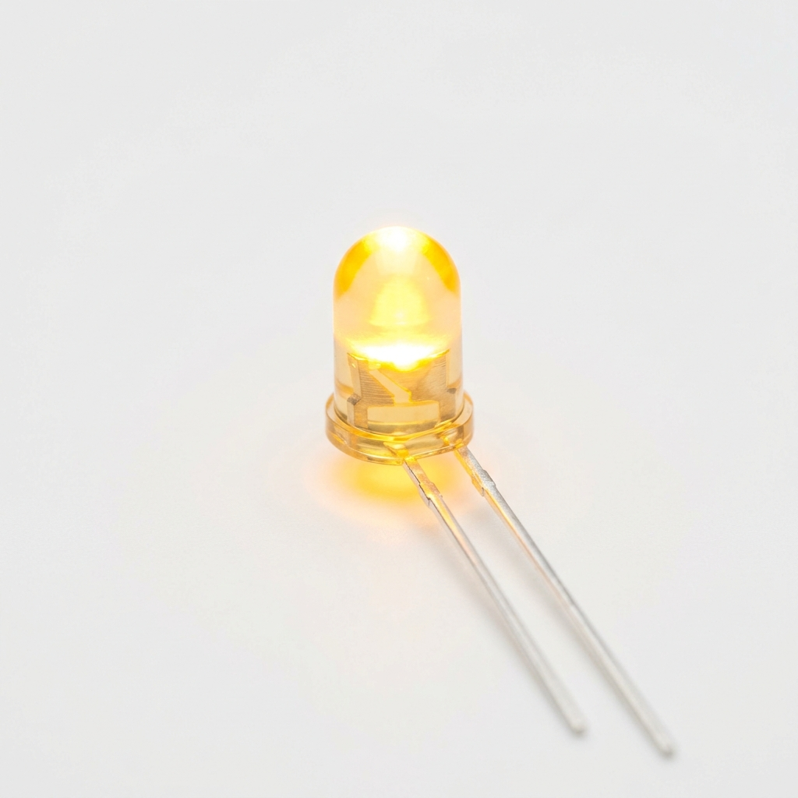 | Hemoglobin-related contrast channel. |
| Red | 625 nm | 3-5 | Kingbright WP7113ID 5mm | $0.35 ea | [Mouser](https://www.mouser.com/ProductDetail/Kingbright/WP7113ID) |  | Lower absorption morphology and normalization channel. |
| Deep Red | 660 nm | 3-5 | Marktech MTE6600N2 660nm | $1.50 ea | [Mouser](https://www.mouser.com/ProductDetail/Marktech-Optoelectronics/MTE6600N2) |  | Deep red comparison/normalization channel. |
| NIR (Optional) | 850 nm | 3-5 | Vishay TSHG6400 850nm | $1.00 ea | [Mouser](https://www.mouser.com/ProductDetail/Vishay-Semiconductors/TSHG6400) | 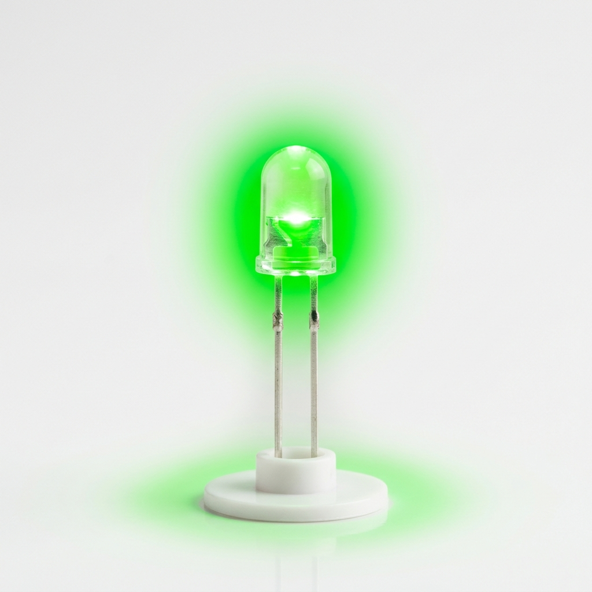 | Optional NIR channel. Verify camera sensitivity. |

> [!NOTE]
> **Recommended Version 1 Wiring:**
> Raspberry Pi -> USB serial -> Raspberry Pi Pico -> SPI-style pins -> Adafruit TLC5947 -> individual LED channels on solderable LED carrier board. Turn on one wavelength group at a time, capture an image, turn it off, then switch to the next wavelength.

> [!WARNING]
> The TLC5947 design is for low-power LEDs only. If illumination is too dim after the diffuser and microscope optics, upgrade to 1W narrowband LEDs mounted on aluminum star boards with dedicated constant-current drivers such as Mean Well LDD-350H or LDD-500H.

## Estimated Total Prototype Cost
- **Absolute cheapest build (Manual XY, 10X lens):** ~$150
- **Recommended prototype build (MGN12 rails, 40X Plan lens, manual):** ~$230
- **Automated motion build (add NEMA 17 & drivers):** ~$280
- **Multispectral low-power LED prototype add-on:** ~$50 to $100 depending on LED quantities, diffuser, connectors, and shipping.
- **High-power multispectral LED upgrade:** Future version, not included in current prototype BOM.
