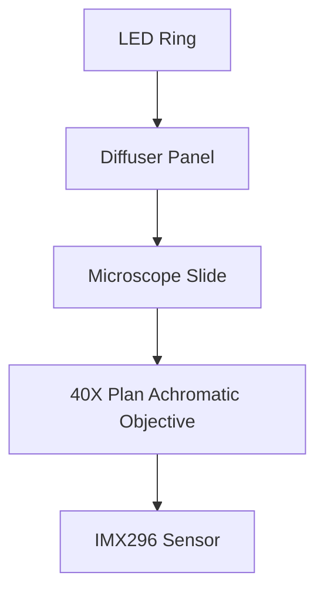

# Prototype Hardware Specification

## 1. Purpose
The prototype hardware provides a rapidly iterable platform for capturing multispectral microscope images, testing stitching algorithms, and developing the initial Computer Vision (CV) and AI pipeline.

## 2. Prototype Success Criteria
- Capture clear microscope images capable of resolving individual cells.
- Capture 5 to 10 overlapping fields of view (FOV).
- Successfully stitch these FOVs with no visible tearing or misalignment.
- Maintain focus across the stitching grid without adjusting the Z-axis (testing XY planarity).

## 3. Functional Requirements
- Securely hold a standard 25x75mm microscope slide.
- Illuminate the sample with controlled intensity.
- Focus the image onto the camera sensor.
- Move the slide in X and Y directions with sufficient precision to achieve 40% to 60% overlap between adjacent images.

## 4. Non-Functional Requirements
- **Cost**: Keep the BOM under $250.
- **Assembly Time**: Under 4 hours for an experienced engineer.
- **Accessibility**: Use widely available parts and standard 3D printing techniques.

## 5. Subsystem Requirements
- **Compute**: Raspberry Pi 4 (4GB minimum) or Pi 5.
- **Camera**: InnovaMaker IMX296 global shutter sensor to eliminate rolling shutter distortion during capture.
- **Optics**: 10X or 40X Plan Achromatic objective. "Plan" is critical to ensure a flat field of view for reliable edge-to-edge stitching.
- **Illumination**: Dimmable LED source, initially white, upgradable to specific wavelengths (e.g., 405nm, 470nm, 530nm, 660nm).

## 6. Mechanical Architecture
A modular, mostly 3D-printed chassis. The frame must be rigid enough to prevent the objective lens from vibrating relative to the sample.

## 7. Optical Architecture

*Note: Depending on the objective design, a tube lens may be required if using an infinity-corrected objective. For standard 160mm objectives, precise spacing to the sensor is required.*

## 8. Illumination Architecture
Bottom-up transmitted light configuration. A diffuser is mandatory to prevent imaging the individual LED dies.

## 9. Motion Architecture

### XY Stage Comparison

| Option | Cost | Difficulty | Accuracy | Recommendation |
| :--- | :--- | :--- | :--- | :--- |
| 1. Fully printed XY stage | ~$2 | Low | Very Low (Stiction, backlash) | Avoid for precise stitching |
| 2. Printed stage + 8mm smooth rods | ~$15 | Medium | Low-Medium | Acceptable for absolute budget |
| 3. MGN12 Linear Rail Stage | ~$40 | Medium | High | **Recommended** |
| 4. Cheap manual microscope stage | ~$30 | Low | Medium (Hard to automate) | Good for manual testing only |

*Recommendation:* Printed frame + MGN12 rails + T8 lead screw + manual knob first, adding NEMA 17 steppers later.

## 10. Electronics Mounting
Provide isolated mounting points for the Raspberry Pi to prevent its cooling fan (if used) from inducing vibration into the optical path.

## 11. 3D Printed Components
- The frame, brackets, camera mount, slide holder, LED/diffuser mount, Pi mount, and motor brackets can be printed.
- **Do not 3D print:** optical lenses, lead screws, precision rails, or bearings.

## 12. Purchased Components
Off-the-shelf fasteners (M3), rails, objectives, and electronics. See the product list.

## 13. Recommended Prototype Dimensions and Assumptions
- Max footprint: 200mm x 200mm.
- Max height: 300mm.
- Assumes standard 160mm optical tube length if using standard biological objectives.

## 14. Tolerances
- XY Planarity: The stage must slide without tilting more than the depth of field of the objective (typically < 2 microns for 40X) to maintain focus across a scan.
- 40% to 60% overlap is required to give the stitching algorithm sufficient feature tolerance.

## 15. Failure Modes
- **Vibration**: Blurs the image. (Use stiff infill, isolating feet).
- **Z-Drift**: Gravity pulling the focus down over time. (Use a fine-pitch lead screw).

## 16. Open Questions
- Should we prioritize an infinity-corrected optical path early on, which allows easy insertion of beam splitters or filters later, or stick to the cheaper 160mm fixed tube length for the prototype?

## 17. Next Iteration Plan
Transition from manual knobs to automated stepper motor control (NEMA 17 with TMC2209 drivers) for fully automated scanning.
